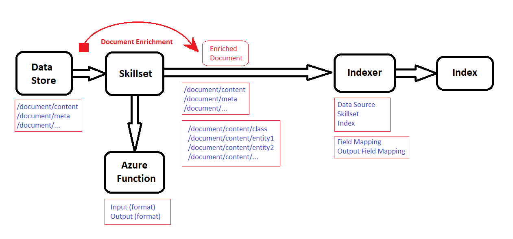

# Cognitive Search Documentation (Development Purposes)

This readme file is intended to explain how to integrate some cognitive service with Cognitive Search.

## How To Integrate

Please follow this step-by-step guide:
1. Create a data store
	- which will contain the data you want to make searchable. Read more [here](https://docs.microsoft.com/en-us/azure/storage/blobs/storage-blobs-introduction).

2. Create a cognitive search resource.
	- You can do it [here](https://ms.portal.azure.com/#blade/HubsExtension/BrowseAll).

After that, you need to do the following in your your cognitive search resource:
- Create an index
	- An index is sort of like a database that have reverse indexing for your documents
	- For example, if your custom model extracts intentions and entities from your documents, your columns of your index should be these entities and intentions.
- Create a data store connection
	- This connection will refer to your data store.
		- connection string
		- container
- Create a custom skillset
	- This skillset is used to enrich your document data, by calling a custom model (your azure function) on your documents, and updating your document tree with the returned data (see image above).
	- Your skillset definition should be like [this](https://docs.microsoft.com/en-us/azure/search/cognitive-search-defining-skillset#add-a-custom-skill)
	- Make sure you clearly understand the inputs and outputs.
- Create an azure function
	- This is basically the azure function the skillset will call when provided with a document.
	- It be very simple. Just calling your actual custom model to extract data from provided documents.
	- follow the input format [here](https://docs.microsoft.com/en-us/azure/search/cognitive-search-custom-skill-web-api#sample-input-json-structure), and output format [here](https://docs.microsoft.com/en-us/azure/search/cognitive-search-custom-skill-web-api#sample-output-json-structure) 
- Create an indexer
	- An indexer is a pull model in cognitive search.
	- It pulls your data from the data store (using the data store connection)
	- Then it runs the skillset to enrich your documents
	- Then it does mapping on the enriched documents to store them in the index
	- Specify sources to use
		- Data source connection name
		- Skillset name
		- Index name
	- Make sure you understand field mapping and output field mapping [here](https://docs.microsoft.com/en-us/rest/api/searchservice/create-indexer#examples)
