# Validating User Inputs

In order to make sure the integration tool works flawlessly, we created this document to guide and help you make sure all your inputs are correct.

## Schema.json file
In order to comply with Cognitive Search, your Custom Text app schema must adhere to the following:
- Entity names: must only contain letters and digits (no spaces or special characters)

## Configs.json file
This section helps you create the required Azure services and also helps you obtain the required service secrets.

### Create Custom Text App

### Storage Account
#### **Create Resource**
Full article [here](https://docs.microsoft.com/en-us/azure/storage/common/storage-account-create?tabs=azure-portal).

Go to azure portal, and create new resource
search for storage account
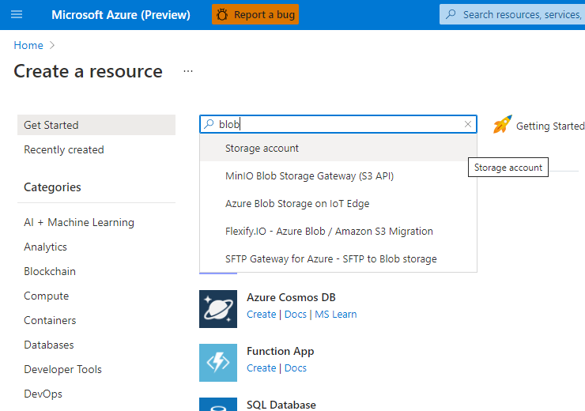
click create
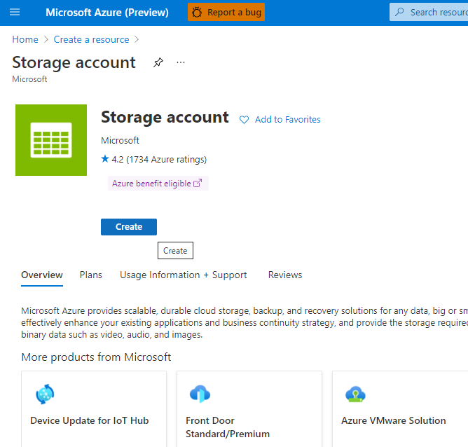
fill in the resource info
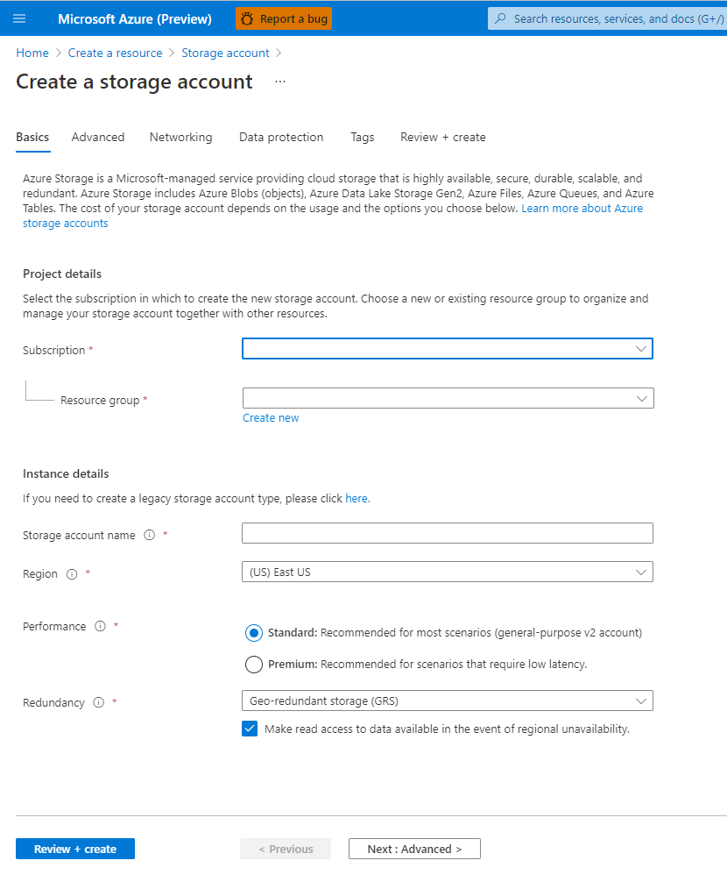
create new container
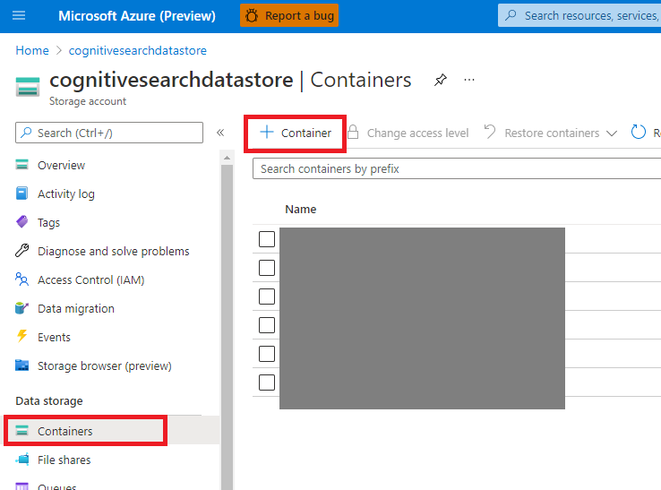

#### **Get Secrets**
Go to your storage account page, then
click on access keys
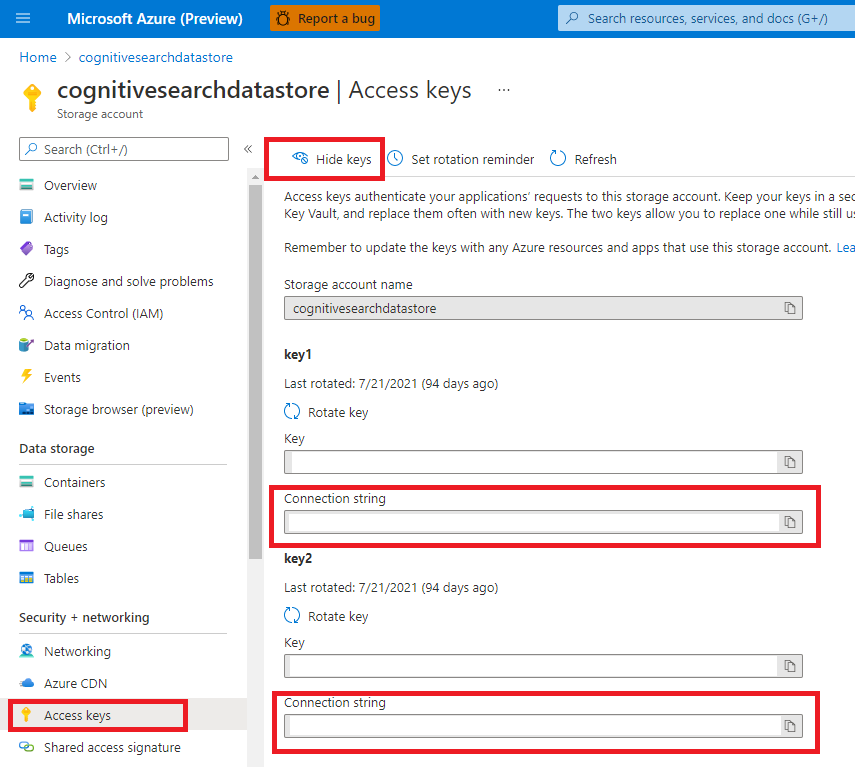

### Azure Function
#### **Create Resource**
Go to azure portal, and create new resource
search for azure function
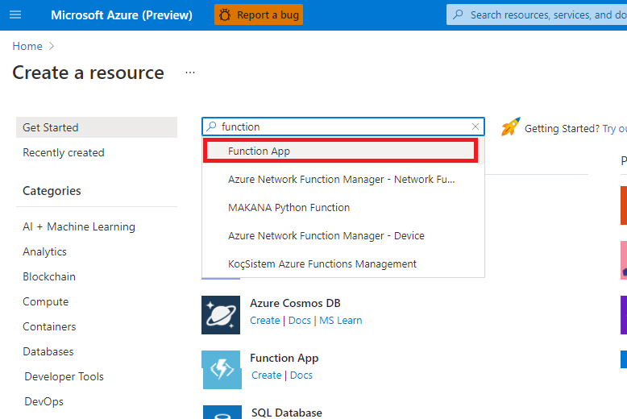
click create
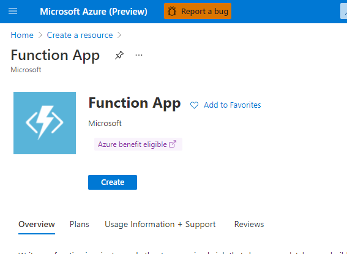
fill in the resource info
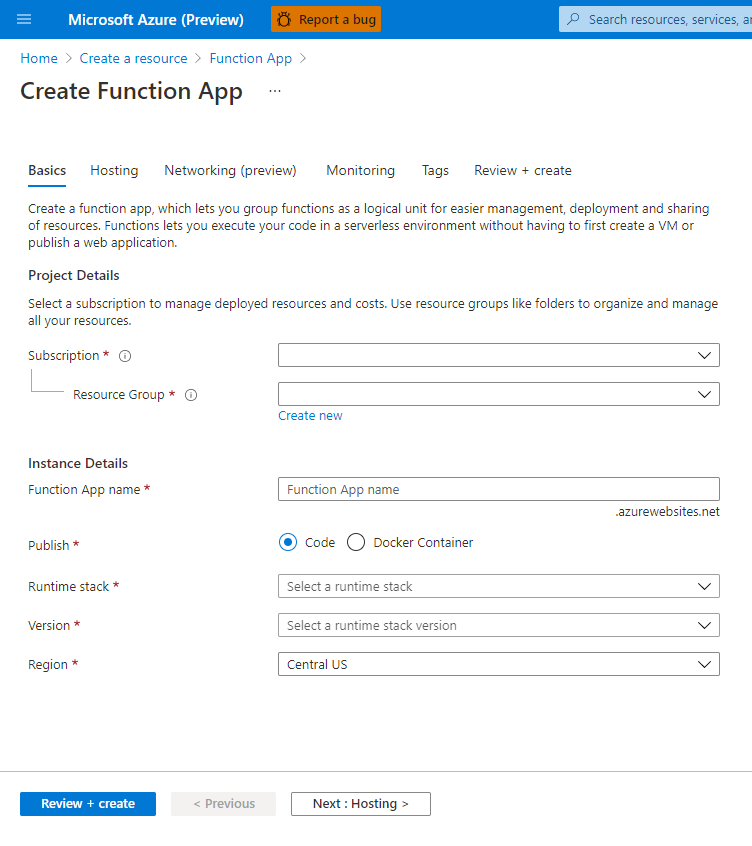

#### **Get Secrets**
Go to your function page, then get function url
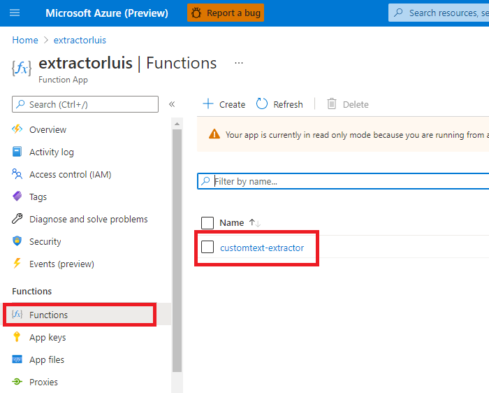
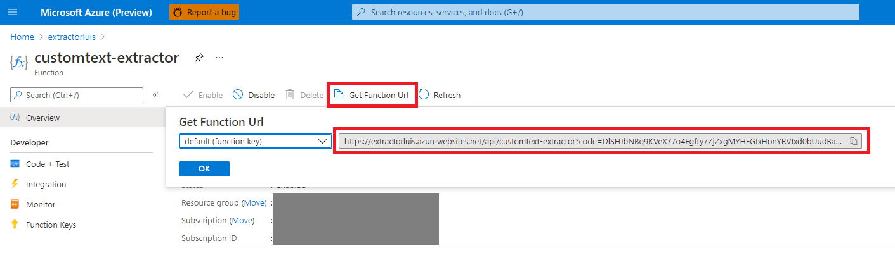

### Cognitive Search
#### **Create Resource**
Go to azure portal, and create new resource
search for cognitive search
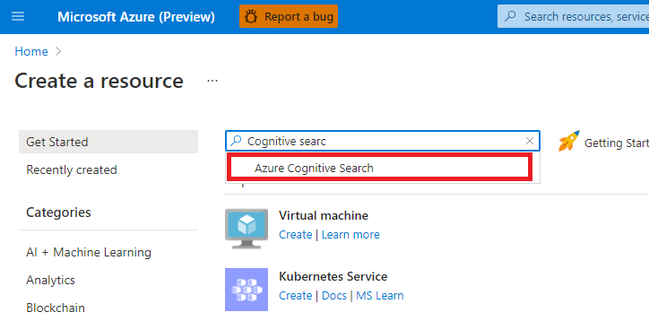
click create
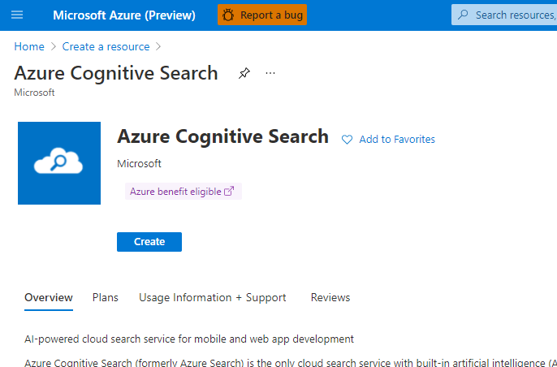
fill in the resource info
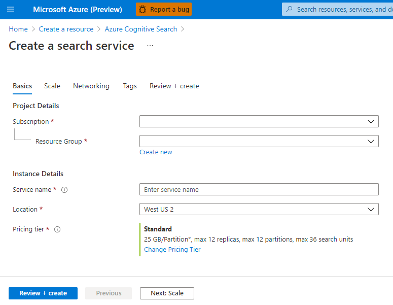

#### **Get Secrets**
Go to your cognitive search page, then
get resource url
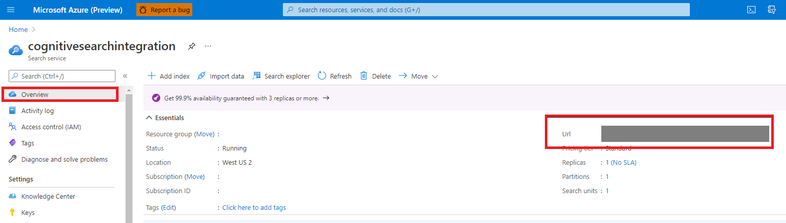
get resource key
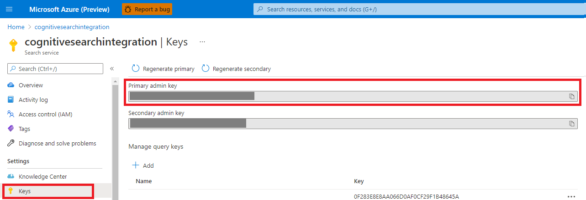

### Custom Text
#### **Create Resource**
See this tutorial on how to create a CT resource and train your app

#### **Get Secrets**
Go to your custom text resource page, then
get resource url and key
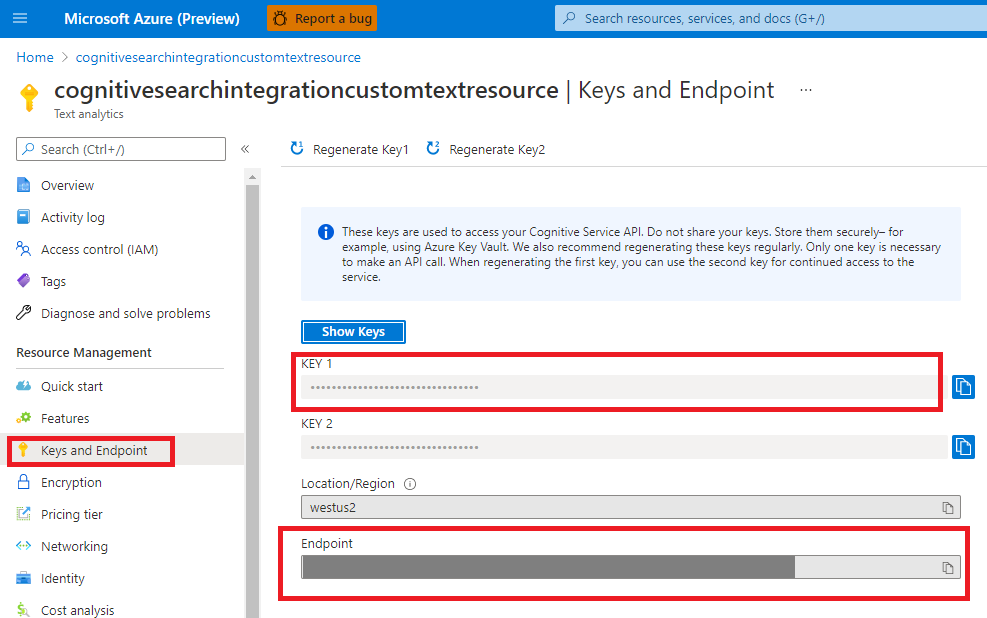
