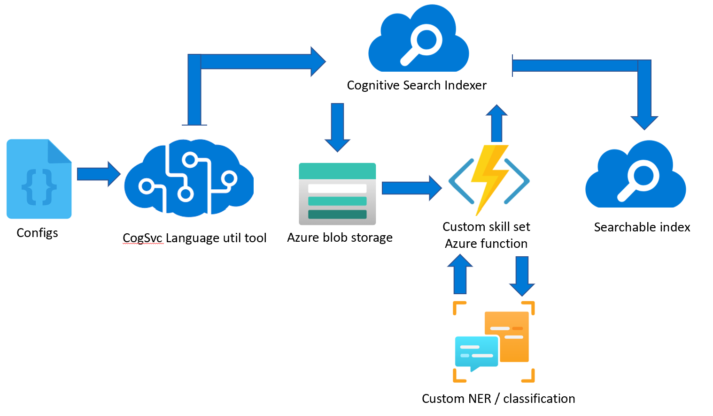

# Cognitive search indexing tool

You can use this tool to enrich your azure search index with the predictions from your [custom named entity extraction](https://aka.ms/ct-docs) and [custom text classification](https://aka.ms/ctc-docs) models.



You can get started by follwoing one of these tutorial for [custom named entity extraction](https://aka.ms/ct-search-tutorial) or [custom text classification](https://aka.ms/ctc-search-tutorial).

![NOTE] Entity names and class names must only contain alphanumeric values (no spaces and no special characters).
 
You can also follow this guide to [create an Azure Cognitive Search service](https://docs.microsoft.com/azure/search/search-create-service-portal).

##  Publish your Azure Function

1. Download and use the [provided sample function](./SampleCustomSkillsetAzureFunction).

2. After you download the sample function, open the *program.cs* file in Visual Studio and [publish the function to Azure](https://docs.microsoft.com/azure/azure-functions/functions-develop-vs#publish-to-azure)

## Prepare configuration file

1. Download [sample configuration file](SampleConfigs.json) and open it in a text editor. 

2. Get your storage account connection string by:
    
    1. Navigating to your storage account overview page in the [Azure portal](https://ms.portal.azure.com/#home). 
    2. In the **Access Keys** section in the menu to the left of the screen, copy your **Connection string** to the `connectionString` field in the configuration file, under `blobStorage`.
    3. Go to the container where you have the files you want to index and copy container name to the `containerName` field in the configuration file, under `blobStorage`. 

3. Get your cognitive search endpoint and keys by:
    
    1. Navigating to your resource overview page in the [Azure portal](https://ms.portal.azure.com/#home).
    2. Copy the **Url** at the top-right section of the page to the `endpointUrl` field within `cognitiveSearch`.
    3. Go to the **Keys** section in the menu to the left of the screen. Copy your **Primary admin key** to the `apiKey` field within `cognitiveSearch`.

4. Get Azure Function endpoint and keys
   
    1. To get your Azure Function endpoint and keys, go to your function overview page in the [Azure portal](https://ms.portal.azure.com/#home).
    2. Go to **Functions** menu on the left of the screen, and click on the function you created.
    3. From the top menu, click **Get Function Url**. The URL will be formatted like this: `YOUR-ENDPOINT-URL?code=YOUR-API-KEY`. 
    4. Copy `YOUR-ENDPOINT-URL` to the `endpointUrl` field in the configuration file, under `azureFunction`. 
    5. Copy `YOUR-API-KEY` to the `apiKey` field in the configuration file, under `azureFunction`. 

5. Get your resource keys endpoint

    1. Navigate to your resource in the [Azure portal](https://ms.portal.azure.com/#home).
    2. From the menu on the left side, select **Keys and Endpoint**. You will need the endpoint and one of the keys for the API requests.

        :::image type="content" source="../../media/azure-portal-resource-credentials.png" alt-text="A screenshot showing the key and endpoint screen in the Azure portal" lightbox="../../media/azure-portal-resource-credentials.png":::

6. Get your custom classification/NER project secrets

    1. You will need your **project-name**, project names are case sensitive.

    2. You will also need the **deployment-name**. 
        * If you have deployed your model via Language Studio, your deployment name will be `prod` by default. 
        * If you have deployed your model programmatically, using the API, this is the deployment name you assigned in your request.

## Run the indexer command

After you have published your Azure function and prepared your configs file, download the [indexer](indexer.exe) you can run the following command.

```console
    indexer index --index-name <name-your-index-here> --configs <absolute-path-to-configs-file>
```
- Check process success
	- Check your cognitive search resource for the created index, data source connection, skillset, and indexer, and make sure the indexer runs without errors (wait for it).
    - Please file any issues [here](https://github.com/microsoft/CognitiveServicesLanguageUtilities/issues) if you have any troubles

## Next steps

Use the SearchClient sdk to search your app (see docs [here](https://docs.microsoft.com/en-us/azure/search/search-howto-dotnet-sdk#run-queries))
