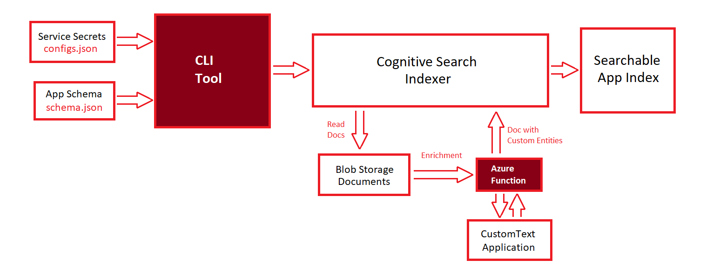

# Cognitive Search Integration

This project aims to integrate your Custom Text app with Cognitive Search. 
Our goal is to make your app searchable.

### Scenario
If you have a Custom Text app which creates custom entities for legal documents, and assuming you have tons of documents in your data storage, you can integrate this app with Cognitive Search to easily search through your documents.
For examples, search for documents that mentioned some company or person, etc.

## How to Index Your App



## First: Prepare Your Resources
Please refer to this [readme][validation_readme] on how to create the required resources and how to obtain the required secrets correctly.


You need to provision the following resources:
 - Custom Text App Resource
   - This is the app you want to integrate with Cognitive Search 
 - Blob Container Data Store
	 - Which contains your Custom Text documents (read more [here](https://docs.microsoft.com/en-us/azure/storage/blobs/storage-blobs-introduction))
 - Cognitive Search Resource
	 - Which we use to index and search your application (read more [here](https://docs.microsoft.com/en-us/azure/search/search-what-is-azure-search))
 - Azure Function Resource
	 - In order to enable Custom Text in the indexing pipeline, Cognitive Search needs an Azure function which calls the prediction endpoint for your Custom Text app.
	 - This is basically an azure function that when provided with some document, runs the Custom Text prediction endpoint and waits till it gets the entities result.


## Second: Deploy the Azure Function
We created the Azure function for you. You can find the required project [here][custom_skillset_azure_function].

Simply deploy the function. See article [here](https://docs.microsoft.com/en-us/azure/azure-functions/functions-develop-vs#publish-to-azure).


## Third: Run the 'Index' command
Using the indexing cli tool, run the 'index' command
 - Configs file
	 - Fill the [configs.json][configs_sample] file with your service secrets (that you already provisioned)
	 - **This configs file needs to be placed next to the cli tool to read it**
	 - Please refer to this [readme][validation_readme] on how to obtain the required secrets correctly.
 - Run the index command
	- use the [indexer cli tool][indexer_cli_tool]
	 - Run the index command, and wait till process finishes
```console
indexer index --index-name <name-your-index-here>
```
- Check process success
	- Check your cognitive search resource for the created index, data source connection, skillset, and indexer, and make sure the indexer runs without errors (wait for it)
    - Please file any issues [here](https://github.com/microsoft/CognitiveServicesLanguageUtilities/issues) if you have any troubles

## Finally: Search your app
Use the SearchClient sdk to search your app (see docs [here](https://docs.microsoft.com/en-us/azure/search/search-howto-dotnet-sdk#run-queries))


[validation_readme]: https://github.com/microsoft/CognitiveServicesLanguageUtilities/blob/dev/CustomTextAnalytics.CognitiveSearch/Docs/Validation.md

[custom_skillset_azure_function]: https://github.com/microsoft/CognitiveServicesLanguageUtilities/tree/dev/CustomTextAnalytics.CognitiveSearch/Solution/CustomTextAzureFunction

[configs_sample]: https://github.com/microsoft/CognitiveServicesLanguageUtilities/blob/dev/CustomTextAnalytics.CognitiveSearch/Samples/configs.json

[indexer_cli_tool]: https://github.com/microsoft/CognitiveServicesLanguageUtilities/blob/dev/CustomTextAnalytics.CognitiveSearch/Samples/indexer.exe

[github_issues]: https://github.com/microsoft/CognitiveServicesLanguageUtilities/issues